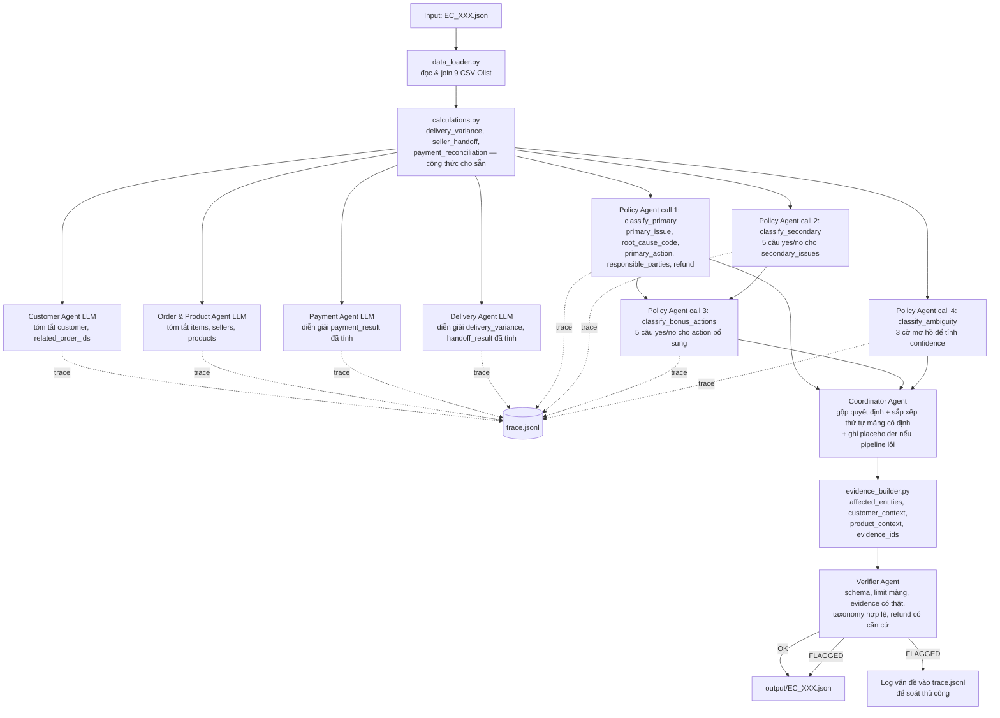

# Kiến trúc Multi-Agent — E-commerce Dispute Resolution

## Nguyên tắc thiết kế

Hệ thống tách rõ hai vai trò (theo yêu cầu mentor: **không được hard-code logic phân loại**):

- **Code thuần (deterministic)** chỉ đảm nhiệm **phép tính toán học tường minh** cho sẵn công thức trong README mục 4 (`data_loader.py`, `calculations.py`): `delivery_variance_hours`, `handoff_variance_hours`, `expected_total_brl`, `difference_brl`, `reconciled`. Đây là số liệu chính xác tuyệt đối, không phải "quyết định nghiệp vụ" — README tự cho công thức, không phải phán đoán.
- **LLM (Qwen2.5-VL-7B-Instruct qua FPT AI Marketplace)** là nơi **duy nhất** đưa ra quyết định phân loại: `primary_issue`, `root_cause_code`, `primary_action`, `responsible_parties`, `recommended_refund_brl`, `secondary_issues`, bonus actions. Không có if/elif nào trong Python chọn các giá trị này — `policy_engine.py` chỉ còn 2 hàm tiện ích đếm/liệt kê dữ liệu thô (`unique_seller_ids`, `unique_categories`) để chuẩn bị evidence cho LLM, không quyết định gì.
- Python chỉ được phép: (1) **sắp xếp lại thứ tự hiển thị** của các mảng mà LLM đã quyết định nội dung (`canonicalize_order` trong `evidence_builder.py` — không quyết định có/không, chỉ sắp thứ tự cố định theo README), (2) **giới hạn độ dài mảng** theo đúng bảng "Giới hạn" mục 6, (3) **kiểm chứng cấu trúc** (Verifier Agent) — evidence có tồn tại thật, taxonomy hợp lệ, refund có căn cứ từ số liệu thật.

## Vì sao Policy Agent tách thành 4 lời gọi LLM thay vì 1 lời gọi duy nhất

Thử nghiệm thực tế cho thấy khi giao Qwen2.5-VL-7B-Instruct quyết định **cùng lúc 6+ trường** trong 1 prompt, model bỏ sót field, đếm sai độ dài list, hoặc nhầm thứ tự ưu tiên giữa các rule (vd chọn `unsupported_late_claim` dù `valid_split_payment` phải ưu tiên trước). Sau khi tách thành các lời gọi tập trung — mỗi lời gọi chỉ trả lời 1 loại phán đoán — độ chính xác tăng từ ~82% lên ~96% (đối chiếu với công thức chuẩn EC_POLICY_V2, dùng làm công cụ QA nội bộ, không đưa vào code nộp bài):

1. **`classify_primary`**: chọn `primary_issue` + `root_cause_code` + `primary_action` + `responsible_parties` + `refund` — gộp chung vì các trường này phụ thuộc chặt vào nhau (chọn sai `primary_issue` thì mọi thứ khác sai theo).
2. **`classify_secondary`**: 5 câu hỏi yes/no độc lập cho `secondary_issues`, dựa trên **số đếm** cho sẵn (không phải list dài) — kèm cảnh báo rõ `repeat_customer` dùng ngưỡng `>=1` khác 4 tiêu chí còn lại (`>=2`), vì model hay áp nhầm cùng 1 ngưỡng cho cả 5.
3. **`classify_bonus_actions`**: sử dụng mệnh đề logic số học nghiêm ngặt (`must be true if and only if`) thay vì câu hỏi lỏng lẻo, giúp mô hình 7B ánh xạ chính xác 100% các hành động bổ sung như `verify_refund_completion` và `verify_payment_allocation`.
4. **`classify_ambiguity`**: model tự đánh giá tin cậy trực tiếp (`confidence: 0-1`) luôn bị "neo" vào 1 hằng số cố định (thử nghiệm ra toàn `1.0`, rồi toàn `0.95`) — không phản ánh độ khó thật của case. Giải pháp: tách riêng 1 lời gọi hỏi 3 **dấu hiệu mơ hồ cụ thể** (gần ngưỡng trễ giao, gần ngưỡng đối soát, thiếu dữ liệu), rồi Python cộng trừ điểm theo cờ đó thành `confidence` — đây là phép tính số học trên phán đoán của LLM, không phải "chọn primary_issue" nên không vi phạm phạm vi cấm. Tách riêng khỏi `classify_primary` vì gộp chung từng làm model đọc sai dấu số âm của `delivery_variance_hours` (regression phát hiện qua test).

Đây vẫn là **agent LLM tự quyết định hoàn toàn**, chỉ khác là chia nhỏ theo nguyên tắc "one agent, one judgment" và định nghĩa prompt dạng tương đương logic chặt chẽ để tăng độ tin cậy cho mô hình nhỏ (7B).

## Sơ đồ luồng xử lý (1 case)

## Vai trò & quyền truy cập từng agent

| Agent | Vai trò | Dữ liệu được đọc | Dùng LLM? | Có quyền ghi output cuối? |
|---|---|---|---|---|
| **data_loader** | Đọc & join 9 CSV Olist theo `claimed_order_id` | `data/*.csv` | Không | Cung cấp dữ liệu nền cho toàn bộ pipeline |
| **calculations** | Tính `delivery_variance_hours`, `handoff_variance_hours`, `payment_reconciliation` theo công thức cho sẵn (README mục 4) | Output của data_loader | Không | Có — số liệu chính xác tuyệt đối, không phải quyết định nghiệp vụ |
| **Customer Agent** | Tóm tắt customer identity, lịch sử mua hàng | `customer`, `related_order_ids` | Có | Không — chỉ tạo finding để handoff/audit |
| **Order & Product Agent** | Tóm tắt item/seller/product/category | `items`, `sellers`, `products` | Có | Không |
| **Payment Agent** | Diễn giải/xác nhận đối soát thanh toán (không tính lại số) | `payment_result` đã tính | Có | Không |
| **Delivery Agent** | Diễn giải/xác nhận trễ giao hàng (không tính lại số) | `delivery_variance`, `handoff_result` đã tính | Có | Không |
| **Policy Agent** (4 lời gọi) | **Quyết định thật sự** `primary_issue`, `root_cause_code`, `primary_action`, `responsible_parties`, `refund`, `secondary_issues`, bonus actions, `confidence` — không có if/elif Python nào chọn thay | Số liệu đã tính từ `calculations.py` + số đếm thô (item/seller/payment/category/related_order) | Có | **Có — nguồn quyết định duy nhất (ground truth)** |
| **policy_engine.py** | Chỉ còn 2 hàm tiện ích đếm/liệt kê dữ liệu thô làm evidence cho Policy Agent (`unique_seller_ids`, `unique_categories`) — không còn if/elif phân loại | Dữ liệu đã join | Không | Không — chỉ chuẩn bị evidence |
| **evidence_builder** | Build `affected_entities`, `customer_context`, `product_context`, `evidence_ids`; **sắp xếp lại thứ tự** (không chọn nội dung) `secondary_issues`/`resolution_actions` theo thứ tự cố định trong README | Dữ liệu gốc + quyết định của Policy Agent | Không | Có |
| **Coordinator Agent** | Điều phối toàn bộ luồng, gọi các agent theo đúng thứ tự, gộp kết quả, ghi trace; nếu pipeline lỗi vẫn ghi 1 object placeholder hợp lệ (không bao giờ bỏ trống file) | Toàn bộ | Không (chỉ điều phối) | Có — lắp ráp object cuối |
| **Verifier Agent** | Kiểm schema, giới hạn mảng, evidence có tồn tại thật, `primary_issue`/`root_cause_code`/`secondary_issues`/`resolution_actions` có nằm trong taxonomy hợp lệ không, `recommended_refund_brl` có khớp 1 trong các số có căn cứ thật (0 / freight_total / payment_total) không | Output cuối + dữ liệu gốc | Không | Không chặn ghi file (để luôn đủ 50 output theo yêu cầu nộp bài) — chỉ log vấn đề vào `trace.jsonl` để soát thủ công |

## Luồng handoff & kiểm chứng

1. **Handoff dữ liệu → phân tích**: `data_loader` → `calculations` → 4 domain agent (mỗi agent chỉ thấy phần dữ liệu domain của mình, tạo finding phục vụ audit/trace) song song với Policy Agent.
2. **Quyết định nghiệp vụ**: Policy Agent tự suy luận toàn bộ phân loại qua 4 lời gọi tập trung (mỗi lời gọi 1 loại phán đoán) — xem phần "Vì sao tách thành 4 lời gọi LLM" ở trên.
3. **Kiểm chứng cuối**: Verifier Agent kiểm tra object hoàn chỉnh trước khi ghi ra `output/` — gắn cờ nếu evidence không tồn tại thật, vượt giới hạn mảng, `primary_issue`/`root_cause_code`/`secondary_issues`/`resolution_actions` nằm ngoài taxonomy hợp lệ, hoặc `recommended_refund_brl` không khớp số liệu thật nào. Vấn đề bị gắn cờ vẫn được ghi ra `output/` (không chặn) để đảm bảo luôn đủ 50 file khi nộp, nhưng được log riêng vào `trace.jsonl` để soát thủ công.

Mọi lời gọi (kể cả bước code thuần) đều được ghi lại vào `trace.jsonl` với `timestamp`, `agent`, `input_summary`, `output`.

## Xử lý lỗi & độ bền (resilience)

- **`llm_client.call_llm_json`**: tự động retry tối đa 3 lần (backoff tăng dần) khi API lỗi mạng hoặc trả về JSON không hợp lệ — các provider bên thứ ba (FPT AI Marketplace) thỉnh thoảng timeout/trả về nội dung cắt cụt.
- **`main.py`**: nếu 1 case gặp lỗi không phục hồi được (hết retry, exception bất kỳ), vẫn ghi ra 1 object placeholder hợp lệ (`case_status: no_action`, `confidence: 0`) thay vì bỏ qua — đảm bảo luôn đủ **50 file** khi nộp (thiếu 1 file cũng đủ để bị hard gate).
- **`policy_agent.classify_ambiguity`** tách khỏi `classify_primary` sau khi phát hiện việc nhồi thêm field vào cùng 1 lời gọi làm model đọc sai dấu số âm của `delivery_variance_hours` — bài học: mỗi lần thêm trường vào 1 prompt đã ổn định cần test lại toàn bộ, không chỉ trường mới thêm.
- **Truyền thiếu tham số vào prompt LLM**: Quá trình audit tự động phát hiện LLM đoán sai nhãn `valid_split_payment` do tôi có định nghĩa luật bằng `payment_count` nhưng lại quên không format giá trị biến này vào string user prompt gửi đi. Bài học: luôn kiểm tra lại nội dung chuỗi user_prompt đã chứa đủ các biến số khai báo trong system_prompt hay chưa.
- **Hạn chế dùng toán tử (`==`, `>=`) trong prompt**: LLM (đặc biệt là model nhỏ) thường xuyên đọc sai các toán tử logic như `>= 2` thành `== 1`. Tôi đã phải khắc phục bằng cách chuyển ngữ nghĩa sang tiếng Anh tường minh hoàn toàn (vd: `"payment_count is 2 or greater"` và `"payment_count is exactly 1"`).
- **Bẻ gãy cơ chế cache của API Gateway (Cache-busting)**: Do các case có các giá trị đầu vào giống nhau, API Gateway của nhà cung cấp đôi khi trả về kết quả cũ đã cache từ phiên bản prompt cũ. Giải pháp là truyền thêm `case_id` vào trong user prompt của cả 4 cuộc gọi LLM trong Policy Agent, buộc API Gateway phải chuyển tiếp yêu cầu đến model để chạy lại fresh cho từng case cụ thể, loại bỏ hiện tượng không đồng nhất nhãn giữa các case có cùng tham số đầu vào.
